# 树

## 红黑树（Red-Black Tree , RBT）

> 红黑树（Red-Black Tree，以下简称RBTree）是一种特化的AVL树（平衡二叉树）
> 红黑树是在1972年由Rudolf Bayer发明的，当时被称为平衡二叉B树（symmetric binary B-trees）.
> 在1978年被 Leo J. Guibas 和 Robert Sedgewick 修改为如今的“红黑树”.

> 红黑树的实际应用非常广泛，比如Linux内核中的完全公平调度器、
> 高精度计时器、ext3文件系统等等，各种语言的函数库如Java的TreeMap和TreeSet，C++ STL的map、multimap、multiset等。

> RBTree也是函数式语言中最常用的持久数据结构之一，在计算几何中也有重要作用。值得一提的是，
> Java 8中HashMap的实现也因为用RBTree取代链表，性能有所提升。

### RBTree的定义

**RBTree的定义如下:**

- 任何一个节点都有颜色，黑色或者红色。
- 根节点是黑色的。
- 父子节点之间不能出现两个连续的红节点。
- 任何一个节点向下遍历到其子孙的叶子节点，所经过的黑节点个数必须相等。
- 叶子节点（NIL）一定是黑色。

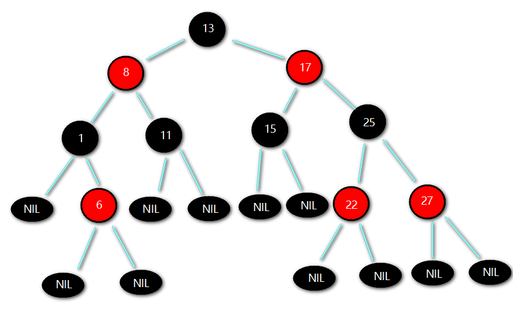

数据结构表示如下：
```java
class Node<T> {
    public T value;
    public Node<T> parent;
    public boolean isRed;
    public Node<T> left;
    public Node<T> right;
}
```

> RBTree在理论上还是一棵BST树，但是它在对BST的插入和删除操作时会维持树的平衡，即保证树的高度在[logN,logN+1]
> （理论上，极端的情况下可以出现RBTree的高度达到2*logN，但实际上很难遇到）。这样RBTree的查找时间复杂度始终保持在O(logN)
> 从而接近于理想的BST。RBTree的删除和插入操作的时间复杂度也是O(logN)。RBTree的查找操作就是BST的查找操作。

### RBTree的旋转操作

> 旋转操作(Rotate)的目的是使节点颜色符合定义，让RBTree的高度达到平衡。
> Rotate分为left-rotate（左旋）和right-rotate（右旋），区分左旋和右旋的方法是：待旋转的节点从左边上升到父节点就是右旋(顺时针)
> ，待旋转的节点从右边上升到父节点就是左旋（逆时针）。


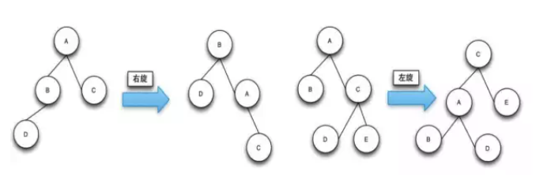

### RBTree的查找操作

RBTree的查找操作和BST的查找操作是一样的。

先与当前节点进行比较：

- 如果相等的话就返回当前节点。
- 如果少于当前节点则继续查找当前节点的左节点。
- 如果大于当前节点则继续查找当前节点的右节点。

直到当前节点指针为空或者查找到对应的节点，程序查找结束。

### RBTree的插入操作

RBTree的插入与BST的插入方式是一致的，只不过是在插入过后，可能会导致树的不平衡，这时就需要对树进行旋转操作和颜色修复（在这里简称插入修复），使得它符合RBTree的定义。

新插入的节点是红色的，插入修复操作如果遇到父节点的颜色为黑则修复操作结束。也就是说，**只有在父节点为红色节点的时候是需要插入修复操作的**。

> 红色破坏原则的可能性最小，如果是黑色, 很可能导致这条支路的黑色节点比其它支路的要多1，破坏了平衡。

插入修复操作分为以下的三种情况，而且新插入的节点的父节点都是红色的：

- 叔叔节点也为红色。
- 叔叔节点为空（黑色），且祖父节点、父节点和新节点处于一条斜线上。
- 叔叔节点为空（黑色），且祖父节点、父节点和新节点不处于一条斜线上。

#### 场景1：红黑树为空树

直接把插入结点作为根节点就可以了

另外：根据红黑树性质 `2根节点是黑色的`。还需要把插入节点设置为黑色。


#### 场景2：插入节点的Key已经存在

更新当前节点的值，为插入节点的值(等于覆盖)。当然这依赖于具体的实现来确定是否允许重复。

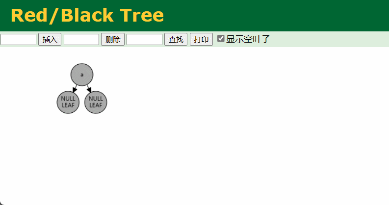

#### 场景3：插入节点的父节点为黑色

由于插入的节点是红色的，当插入节点的父节点是黑色时，不会影响红黑树的平衡，

所以： **直接插入无需做自平衡**。


#### 情景4：插入节点的父节点为红色

根据性质2：根节点是黑色。

如果插入节点的父节点为红色节点，那么该父节点不可能为根节点，所以插入节点总是存在祖父节点(三代关系)。

根据性质4：每个红色节点的两个子节点一定是黑色的。不能有两个红色节点相连。

此时会出现两种状态：

- 父亲和叔叔为红色

- 父亲为红色，叔叔为黑色

如图

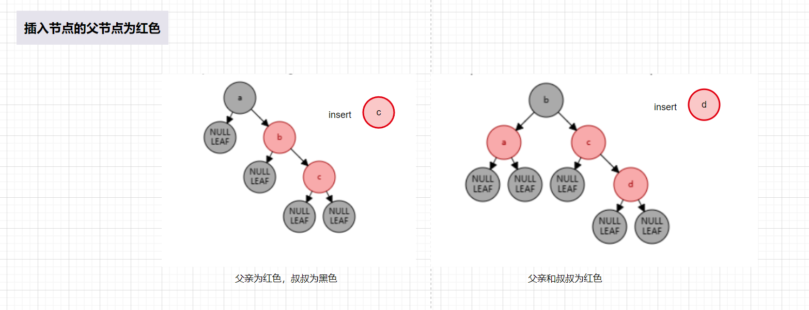

##### 场景4.1 父亲和叔叔为红色节点
根据性质3：父子阶段之间不能出现两个连续的红色节点：

父亲为红色，祖父节点肯定为黑色，那么此时该插入子树的红黑树层数的情况是：黑红红。

因为不可能同时存在两个相连的红色节点，需要进行 变色， 显然处理方式是把其改为：红黑红

**变色** 处理：黑红红 ==> 红黑红

> 父节点、叔叔节点设为黑，祖父节点设为红色
> 当前节点设为祖父节点，接着下一轮的修复

1.将a和c节点改为黑色

2.将b改为红色

3.将b设置为当前节点，进行后续处理(b节点为root节点，改为黑色)

> 后续处理：判断是否为根节点或父节点是否为红进行修复（可参考代码）

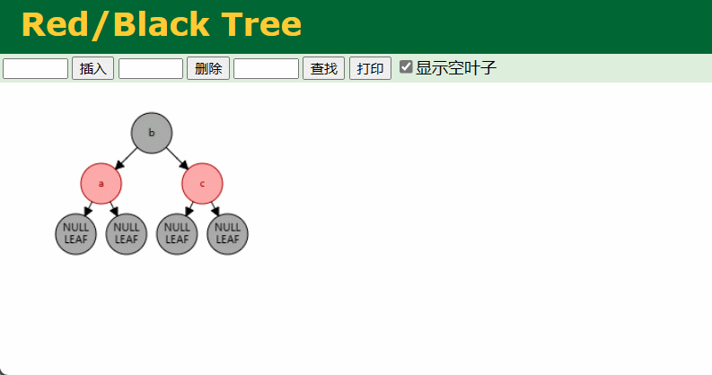

##### 场景4.2 叔叔为黑色，父亲为红色

分为两种情况

插入节点和父节点、祖父节点在一条线上
插入节点和父节点、祖父节点不在一条线上

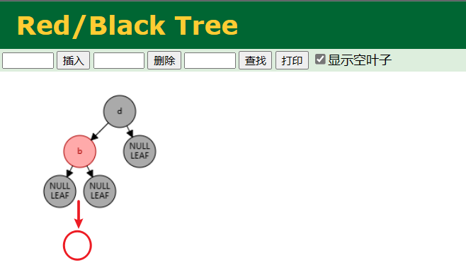

##### 场景4.2.1 LL型失衡

新插入节点，为其父节点的左子节点(LL红色情况)， 插入后 就是LL 型失衡

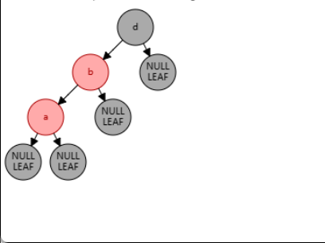

> 修复处理：

1.对b节点进行右旋

2.变颜色：

将b设置为黑色，将d设置为红色


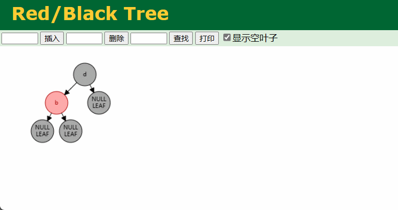

##### 场景4.2.2 LR型失衡

新插入节点，为其父节点的右子节点(LR红色情况)， 插入后 就是LR 型失衡

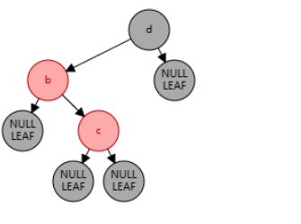

> 自平衡处理：

1.对c进行左旋

2.将c设置为当前节点，得到LL红色情况

3.按照LL红色情况处理(1.右旋d节点 2.变色)


### BRTree的删除操作

删除操作首先需要做的也是BST的删除操作，删除操作会删除对应的节点，如果是叶子节点就直接删除，如果是非叶子节点，会用对应的中序遍历的后继节点来顶替要删除节点的位置。删除后就需要做删除修复操作，使的树符合红黑树的定义，符合定义的红黑树高度是平衡的。

删除修复操作在遇到被删除的节点是红色节点或者到达root节点时，修复操作完毕。

删除修复操作是针对删除黑色节点才有的，当黑色节点被删除后会让整个树不符合RBTree的定义的第四条。需要做的处理是从兄弟节点上借调黑色的节点过来，如果兄弟节点没有黑节点可以借调的话，就只能往上追溯，将每一级的黑节点数减去一个，使得整棵树符合红黑树的定义。

删除操作的总体思想是从兄弟节点借调黑色节点使树保持局部的平衡，如果局部的平衡达到了，就看整体的树是否是平衡的，如果不平衡就接着向上追溯调整。

删除修复操作分为四种情况(删除黑节点后)：

- 待删除的节点的兄弟节点是红色的节点。
- 待删除的节点的兄弟节点是黑色的节点，且兄弟节点的子节点都是黑色的。
- 待调整的节点的兄弟节点是黑色的节点，且兄弟节点的左子节点是红色的，右节点是黑色的(兄弟节点在右边)，如果兄弟节点在左边的话，就是兄弟节点的右子节点是红色的，左节点是黑色的。
- 待调整的节点的兄弟节点是黑色的节点，且右子节点是是红色的(兄弟节点在右边)，如果兄弟节点在左边，则就是对应的就是左节点是红色的。

`太难了，我看不进去了`
#### 场景1
由于兄弟节点是红色节点的时候，无法借调黑节点，所以需要将兄弟节点提升到父节点，由于兄弟节点是红色的，根据RBTree的定义，兄弟节点的子节点是黑色的，就可以从它的子节点借调了。

case 1这样转换之后就会变成后面的case 2，case 3，或者case 4进行处理了。上升操作需要对C做一个左旋操作，如果是镜像结构的树只需要做对应的右旋操作即可。

之所以要做case 1操作是因为兄弟节点是红色的，无法借到一个黑节点来填补删除的黑节点。

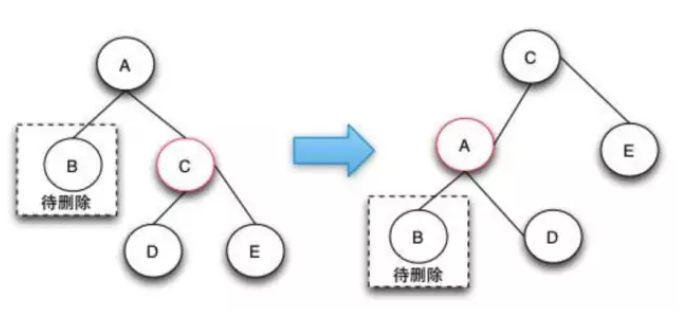

#### 场景2

case 2的删除操作是由于兄弟节点可以消除一个黑色节点，因为兄弟节点和兄弟节点的子节点都是黑色的，所以可以将兄弟节点变红，这样就可以保证树的局部的颜色符合定义了。这个时候需要将父节点A变成新的节点，继续向上调整，直到整颗树的颜色符合RBTree的定义为止。

case 2这种情况下之所以要将兄弟节点变红，是因为如果把兄弟节点借调过来，会导致兄弟的结构不符合RBTree的定义，这样的情况下只能是将兄弟节点也变成红色来达到颜色的平衡。当将兄弟节点也变红之后，达到了局部的平衡了，但是对于祖父节点来说是不符合定义4的。这样就需要回溯到父节点，接着进行修复操作。

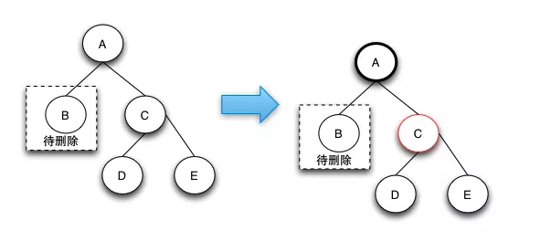

#### 场景3

case 3的删除操作是一个中间步骤，它的目的是将左边的红色节点借调过来，这样就可以转换成case 4状态了，在case 4状态下可以将D，E节点都阶段过来，通过将两个节点变成黑色来保证红黑树的整体平衡。

之所以说case-3是一个中间状态，是因为根据红黑树的定义来说，下图并不是平衡的，他是通过case 2操作完后向上回溯出现的状态。之所以会出现case 3和后面的case 4的情况，是因为可以通过借用侄子节点的红色，变成黑色来符合红黑树定义4。

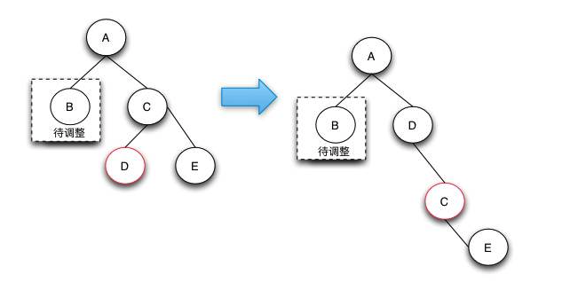

#### 场景4

Case 4的操作是真正的节点借调操作，通过将兄弟节点以及兄弟节点的右节点借调过来，并将兄弟节点的右子节点变成红色来达到借调两个黑节点的目的，这样的话，整棵树还是符合RBTree的定义的。

Case 4这种情况的发生只有在待删除的节点的兄弟节点为黑，且子节点不全部为黑，才有可能借调到两个节点来做黑节点使用，从而保持整棵树都符合红黑树的定义。

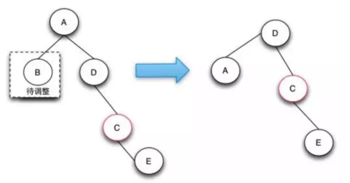

#### 删除操作的总结
红黑树的删除操作是最复杂的操作，复杂的地方就在于当删除了黑色节点的时候，如何从兄弟节点去借调节点，以保证树的颜色符合定义。由于红色的兄弟节点是没法借调出黑节点的，这样只能通过选择操作让他上升到父节点，而由于它是红节点，所以它的子节点就是黑的，可以借调。

对于兄弟节点是黑色节点的可以分成3种情况来处理，当所以的兄弟节点的子节点都是黑色节点时，可以直接将兄弟节点变红，这样局部的红黑树颜色是符合定义的。但是整颗树不一定是符合红黑树定义的，需要往上追溯继续调整。

对于兄弟节点的子节点为左红右黑或者 (全部为红，右红左黑)这两种情况，可以先将前面的情况通过选择转换为后一种情况，在后一种情况下，因为兄弟节点为黑，兄弟节点的右节点为红，可以借调出两个节点出来做黑节点，这样就可以保证删除了黑节点，整棵树还是符合红黑树的定义的，因为黑色节点的个数没有改变。

红黑树的删除操作是遇到删除的节点为红色，或者追溯调整到了root节点，这时删除的修复操作完毕。

### 总结
作为平衡二叉查找树里面众多的实现之一，红黑树无疑是最简洁、实现最为简单的。红黑树通过引入颜色的概念，通过颜色这个约束条件的使用来保持树的高度平衡。作为平衡二叉查找树，旋转是一个必不可少的操作。通过旋转可以降低树的高度，在红黑树里面还可以转换颜色。

红黑树里面的插入和删除的操作比较难理解，这时要注意记住一点：操作之前红黑树是平衡的，颜色是符合定义的。在操作的时候就需要向兄弟节点、父节点、侄子节点借调和互换颜色，要达到这个目的，就需要不断的进行旋转。所以红黑树的插入删除操作需要不停的旋转，一旦借调了别的节点，删除和插入的节点就会达到局部的平衡（局部符合红黑树的定义），但是被借调的节点就不会平衡了，这时就需要以被借调的节点为起点继续进行调整，直到整棵树都是平衡的。在整个修复的过程中，插入具体的分为3种情况，删除分为4种情况。

整个红黑树的查找，插入和删除都是O(logN)的，原因就是整个红黑树的高度是logN，查找从根到叶，走过的路径是树的高度，删除和插入操作是从叶到根的，所以经过的路径都是logN。
参考：

https://www.cnblogs.com/crazymakercircle/p/16320430.html

https://tech.meituan.com/2016/12/02/redblack-tree.html

[数据结构可视化](http://www.u396.com/wp-content/collection/data-structure-visualizations/)