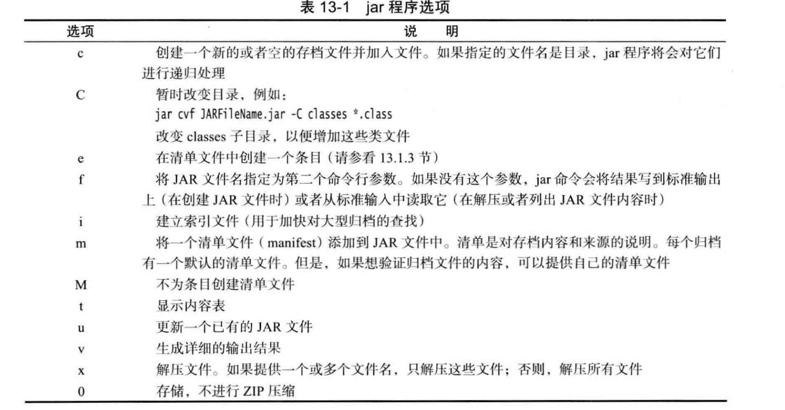

# 打jar包命令

基本命令

```
jar cvf hello.jar Hello.class
```

添加清单文件

```
jar cfm hello.jar MANIFEST.MF Hello.class
```

MANIFEST.MF

```manifest
Manifest-Version: 1.1
Created-By: zjw
Main-Class: Hello

```

> 清单文件的结尾需要换行！

打包参数列表




运行jar包

```
D:\系统文件夹\Desktop>java -jar hello.jar
Hello World!
```

